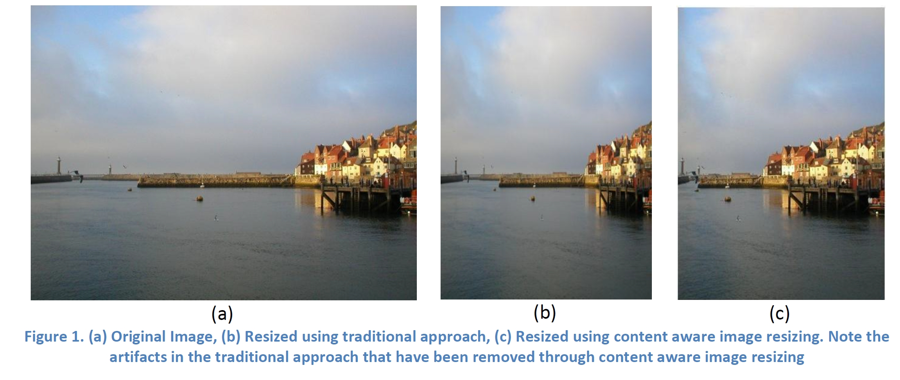
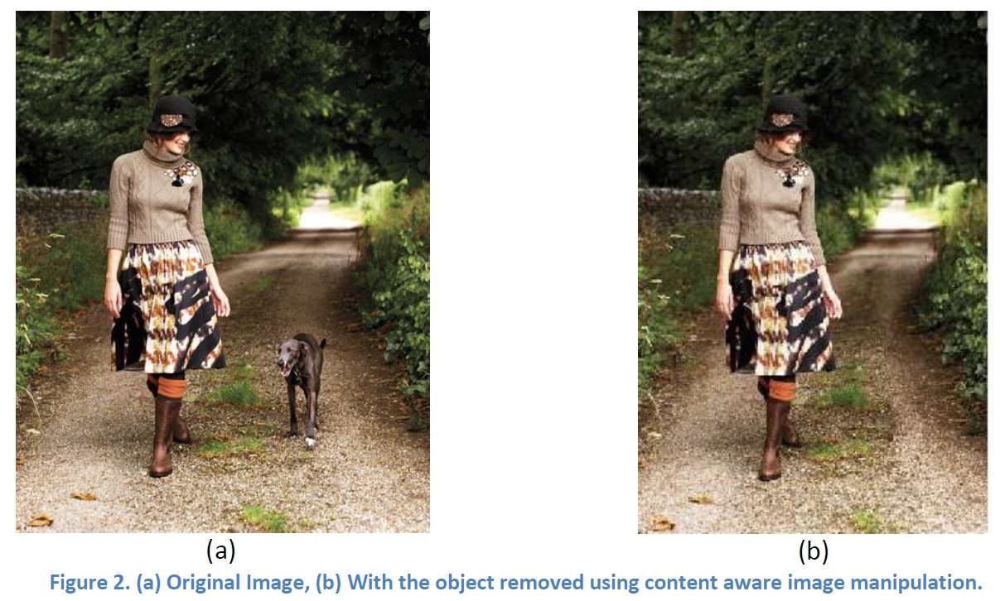

# CAIM: Content Aware Image Manipulation

### M. Rizwan, Waleed A. Malik amd Fayyaz Minhas
### Department of Computer and Information Sciences 
### Pakistan Institute of Engineering and Applied Sciences (PIEAS), PO Nilore, Islamabad, Pakistan
### 15 May, 2010
### URL: http://faculty.pieas.edu.pk/fayyaz/ 
### Lab Facebook Page: https://www.facebook.com/bmirlab/ 

This work focuses on content aware image resizing and object removal. Traditional image resizing techniques do not consider the content of the image and as a result these techniques produce artifacts such as change in the aspect ratio of different objects in the image. The technique [1] implemented in this project uses dynamic programming to identify a seam (a set of connected pixels on a single image from top to bottom or from left to right) in the image over which a certain energy function or map (e.g. sum of the absolute values of the horizontal and vertical image gradients) is minimized. This seam is then removed from the image and as a result the size of the image is reduced with minimal loss of important information from the image. This process is repeated over and over again until the desired size of the image is obtained. Figure-1 below shows the effect of content aware image resizing in comparison to the conventional resizing method. It clearly shows the effectiveness of the proposed scheme. The concept of finding a seam using dynamic programming can also be extended to removal of objects from images in an intelligent manner. In this process the object to be removed from an image is marked using a simple user interface by the user. The software, in its computation of the energy map, sets the value of the pixels corresponding to that object to very small values which forces the seams to pass through that object and as a result the unwanted object is removed during size reduction. The loss of visual quality is automatically minimized in the process due to dynamic programming. Figure-2 shows an example of object removal from an image. The Matlab implementation of the technique is available here.

## Running: 
You can run the code in Matlab. The file is: compec.m.

## References:
[1] Avidan, Shai, and Ariel Shamir. ["Seam carving for content-aware image resizing."](https://dl.acm.org/citation.cfm?id=1276390) ACM Transactions on graphics (TOG). Vol. 26. No. 3. ACM, 2007.

